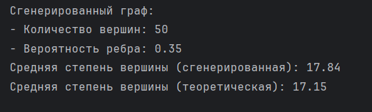
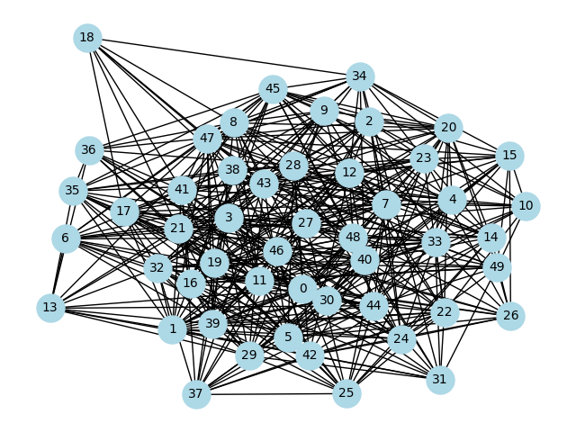

# Анализ социальных сетей

## Задание 2

С использованием библиотеки NetworkX требуется написать скрипт для вычисления меры центральности в собственных векторах для некоторого графа.
Предоставлена некоторая характеристика мер центральности вершин несложного графа, и требуется подобрать (вручную, не нужно автоматизировать) исходный граф, в которой меры центральности удовлетворяют заданным характеристикам. 
Требуется получить центральность для четырёх узлов, среди которых три имеют одинаковую центральность, а четвёртый — отличающуюся от них в большую сторону.

### Основные шаги реализации:
1. **Установка окружения**: 
   - Проект был разработан в крякнутом [PyCharm Professional](https://gtorrent.cc/programmy/rabota-s-faylami/259496-jetbrains-pycharm-professional-202331-repack-by-sitego-en.html). Необходимые библиотеки:
     - NetworkX
     - Matplotlib

2. **Создание графа**: 
   - Создан  граф, состоящий из 4 узлов с указанными характеристиками.
   - Каждому узлу добавляются ребра в соответствии с условиями задания.

3. **Вычисление центральности**:
   - Используя функцию `eigenvector_centrality_numpy` из библиотеки NetworkX, были вычислены значения центральности для каждого узла графа.
     


4. **Визуализация**:
   - Граф визуализируется с помощью Matplotlib, где узлы отображаются с использованием различных параметров для увеличения читаемости.

5. **Сохранение результатов**:
   - Граф сохраняется в файл, что позволяет наглядно видеть результаты.
     
## Установка

Для установки необходимых библиотек используйте pip:

```bash
pip install networkx matplotlib
