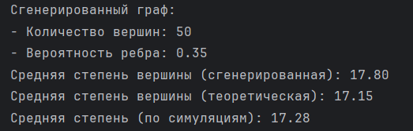

# Анализ социальных сетей

## Задание 3: Генерация графа модели Эрдёша-Реньи
Скрипт реализует генерацию случайного графа в модели Эрдёша-Реньи с использованием библиотеки **NetworkX**. Цель — сравнить среднюю степень вершины, вычисленную для сгенерированного графа, с её теоретическим значением.
```
Задание:
С использованием библиотеки NetworkX требуется написать скрипт для генерации графа в модели Эрдёша-Реньи с заданными характеристиками. 
Преподавателем будут даны значения количества вершин = 50 и вероятность появления случайного ребра = 0.35.
Требуется вычислить в программе среднюю степень вершины и сравнить её со значением средней степени вершины, полученной по формуле из материала лекций.
```
### Характеристики графа
- **Количество вершин:** 50
- **Вероятность ребра:** 0.35

### Основные результаты:
1. **Сгенерированная средняя степень вершины:** 17.84
2. **Теоретическая средняя степень вершины:** 17.15
3. **Разница:** Отклонение вызвано случайным характером генерации рёбер, что ожидаемо для этой модели.
4. **При многократной генерации** среднее значение будет стремится к теоретическому


* **При генерации в 100 циклов**




### Формула теоретической средней степени:
 c = (n - 1)*p = (50-1)*0.35 = 17.15 <br> где кол-во вершин = n = 50, <br> а вероятность появления ребра = p = 0.35

### Используемые технологии:
- **Язык программирования:** Python
- **Библиотеки:** 
  - NetworkX — генерация графов.
  - Matplotlib — визуализация.
  - NumPy — вычисления.

### Визуализация графа:
Граф сохранён в файл `my_graph.png` и наглядно отображает структуру случайного графа.


### Запуск проекта:
1. Убедитесь, что установлены библиотеки:
   ```bash
   pip install networkx matplotlib numpy
   ```
2. Запустите скрипт:
   ```bash
   python script_name.py
   ```

### Итого:
Скрипт корректно реализует модель Эрдёша-Реньи. Результаты соответствуют теоретическим ожиданиям с допустимыми отклонениями.
